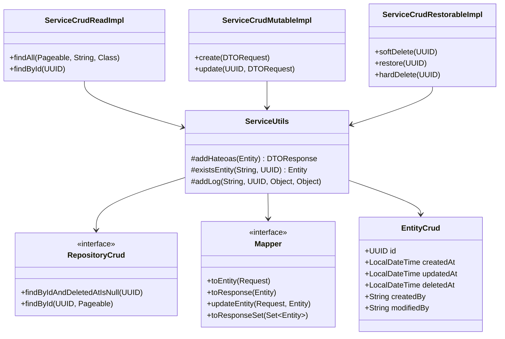

# ANÁLISE ARQUITETURAL — forgepack-core

> **Versão analisada:** 0.0.23 | **Stack:** Java 25 · Spring Boot 4.1.0 · Maven
> **Data:** 14/09/2026

---

## 1. VISÃO GERAL

`forgepack-core` é uma biblioteca Spring Boot de auto-configuração que oferece uma camada CRUD genérica e reutilizável. O consumidor herda interfaces e classes abstratas para construir controllers, services e repositories sem código repetitivo, obtendo automaticamente:

- Paginação + filtragem dinâmica
- Auditoria automática (timestamps + autor somente com forgepack-authentication)
- Soft delete / Hard delete / Restore
- HATEOAS em todas as respostas
- OpenAPI (Swagger UI) auto-configurado
- Validação de request via Bean Validation

---

## 2. ESTRUTURA DE PACOTES

```
dev.forgepack.core
├── api/                        ← Contratos públicos (interfaces, records)
│   ├── controller/
│   │   ├── ControllerCrudRead          # GET /  e GET /{id}
│   │   ├── ControllerCrudMutable       # POST / e PUT /{id}
│   │   └── ControllerCrudRestorable    # DELETE /{id}/permanent · POST /{id}/restore
│   ├── mapper/
│   │   └── Mapper                      # toEntity · toResponse · updateEntity · toResponseSet
│   ├── model/
│   │   └── EntityCrud          # @MappedSuperclass: UUID id, timestamps, soft delete
│   ├── payload/
│   │   └── DTOIdentifiable             # contrato: T id()
│   ├── repository/
│   │   ├── RepositoryCrud              # JpaRepository<T, UUID> + findByIdAndDeletedAtIsNull
│   │   └── RepositoryCrudWithName      # extensão com queries por campo "name"
│   └── service/
│       ├── ServiceCrudRead             # findAll(pageable, value, class) · findById
│       ├── ServiceCrudMutable          # create · update
│       └── ServiceCrudRestorable       # softDelete · restore · hardDelete
│
└── internal/                   ← Implementações privadas (não referenciar externamente)
    ├── configuration/
    │   ├── ConfigurationJPAAuto        # @AutoConfiguration: ComponentScan + JPA + EntityScan
    │   ├── ConfigurationHateoas        # @EnableSpringDataWebSupport(VIA_DTO)
    │   ├── ConfigurationOpenAPI        # Bean OpenAPI via PropertiesOpenAPI
    │   ├── PropertiesOpenAPI           # @ConfigurationProperties(prefix="forgepack.openapi")
    │   └── PropertiesCache             # @ConfigurationProperties(prefix="forgepack.cache")
    ├── controller/
    │   ├── ControllerCrudReadImpl      # implementação abstrata de ControllerCrudRead
    │   ├── ControllerCrudMutableImpl   # implementação abstrata de ControllerCrudMutable
    │   └── ControllerCrudRestorableImpl# implementação abstrata de ControllerCrudRestorable
    └── service/
        ├── ServiceCrudReadImpl         # implementação abstrata de ServiceCrudRead
        ├── ServiceCrudMutableImpl      # implementação abstrata de ServiceCrudMutable
        ├── ServiceCrudRestorableImpl   # implementação abstrata de ServiceCrudRestorable
        └── ServiceUtils                # utilitários internos: HATEOAS, log, existsEntity
```

### Ponto de entrada da auto-configuração

```
src/main/resources/META-INF/spring/
  org.springframework.boot.autoconfigure.AutoConfiguration.imports
    → dev.forgepack.core.internal.configuration.ConfigurationJPAAuto
```

---

## 3. MODELO DE HERANÇA / COMPOSIÇÃO

A biblioteca usa **herança de interface + classe abstrata** em três eixos ortogonais:


|Capacidade        | Interface (api/)          | Implementação (internal/)    |
|------------------|---------------------------|------------------------------|
|Leitura           | ControllerCrudRead        | ControllerCrudReadImpl       |
|                  | ServiceCrudRead           | ServiceCrudReadImpl          |
|Mutação           | ControllerCrudMutable     | ControllerCrudMutableImpl    |
|                  | ServiceCrudMutable        | ServiceCrudMutableImpl       |
|Ciclo de vida     | ControllerCrudRestorable  | ControllerCrudRestorableImpl |
|                  | ServiceCrudRestorable     | ServiceCrudRestorableImpl    |


O consumidor compõe as capacidades que precisa via múltipla herança de interfaces, herdando apenas as classes abstratas correspondentes.

### Parâmetros de tipo recorrentes

| Parâmetro     | Restrição                                    | Papel                          |
|---------------|----------------------------------------------|--------------------------------|
| `Entity`      | `extends EntityCrud`                 | Entidade JPA                   |
| `DTORequest`  | `extends DTOIdentifiable<UUID>`              | Payload de entrada             |
| `DTOResponse` | `extends RepresentationModel<DTOResponse>`   | Payload de saída (HATEOAS)     |

---

## 4. FLUXO DE EXECUÇÃO (exemplo: CREATE)

```
POST /resource
  └─ ControllerCrudMutableImpl.create(DTORequest)
       └─ @Valid (Bean Validation)
       └─ ServiceCrudMutableImpl.create(DTORequest)
            └─ Mapper.toEntity(DTORequest)          → Entity
            └─ RepositoryCrud.save(entity)          → Entity (persistida)
            └─ ServiceUtils.addLog(...)
            └─ ServiceUtils.addHateoas(entity)
                 └─ Mapper.toResponse(entity)        → DTOResponse
                 └─ .add(Link.of(uri, SELF))         → DTOResponse + link HATEOAS
       └─ ResponseEntity.created(location).body(body)
```

---

## 5. DEPENDÊNCIAS EXTERNAS

| Dependência                    | Versão        | Finalidade                                   |
|--------------------------------|---------------|----------------------------------------------|
| `forgepack-utils`              | 0.0.7         | Email, QR code, criptografia AES             |
| `forgepack-validation`         | 0.0.6         | Anotações de validação customizadas          |
| `hibernate-envers`             | (BOM)         | Histórico de auditoria em tabelas `_AUD`     |
| `commons-lang3`                | (BOM)         | Utilitários de string e reflexão             |
| `commons-beanutils`            | 1.11.0        | Conversão de tipos em filtragem dinâmica     |
| `springdoc-openapi`            | 3.0.3         | Swagger UI / OpenAPI 3                       |
| `spring-boot-starter-data-jpa` | (BOM 4.1.0)   | JPA + Spring Data                            |
| `spring-boot-starter-hateoas`  | 4.1.0         | Links HATEOAS nas respostas                  |

---

## 6. PONTOS FORTES

---

## 7. PONTOS FRACOS E OPORTUNIDADES DE MELHORIA

> **Legenda de status:** ✅ Resolvido · ⚠️ Parcialmente corrigido · ❌ Pendente · 🔵 Decisão de design

---

### 7.3 ❌ ALTO — Reflexão frágil na filtragem dinâmica

```java
Field field = ReflectionUtils.findField(entity, propertyName);  // pode retornar null
Method setter = object.getClass().getDeclaredMethod(setterName, field.getType());
Object convertedValue = ConvertUtils.convert(value, field.getType());
setter.invoke(object, convertedValue);
```

O bloco inteiro está dentro de um `try-catch (Exception)` que faz fallback para `findAll` sem filtro, o que mitiga crashes em produção. Porém os problemas estruturais permanecem:

| Problema | Impacto |
|---|---|
| `field` pode ser `null` → NPE silenciosa | Filtro ignorado sem aviso ao consumidor |
| Depende de setter convencional (`setXxx`) | Quebra com Records e Lombok `@Accessors(fluent = true)` |
| `ConvertUtils` não suporta tipos modernos (`UUID`, `Instant`, enums) | Filtro ignorado para esses campos |
| Critério de filtro atrelado ao campo de ordenação | Comportamento contraintuitivo e não documentado |

**Recomendação detalhada:** Estender `RepositoryCrud` com `JpaSpecificationExecutor<Entity>` e construir um `Specification` em vez de `Example` por reflexão:

```java
// Adicionar em RepositoryCrud:
interface RepositoryCrud<T extends EntityCrud>
    extends JpaRepository<T, UUID>, JpaSpecificationExecutor<T> { ... }

// Em ServiceCrudReadImpl.findAll:
Specification<Entity> spec = (root, query, cb) ->
    StringUtils.hasText(value)
        ? cb.like(cb.lower(root.get(propertyName).as(String.class)),
                  "%" + value.toLowerCase() + "%")
        : cb.conjunction();
return repositoryGeneric.findAll(spec, pageable).map(this::addHateoas);
```

Isso elimina reflexão, `ConvertUtils` e setters; suporta Records e qualquer tipo de campo.

## 8. DIAGRAMA DE RELACIONAMENTO


